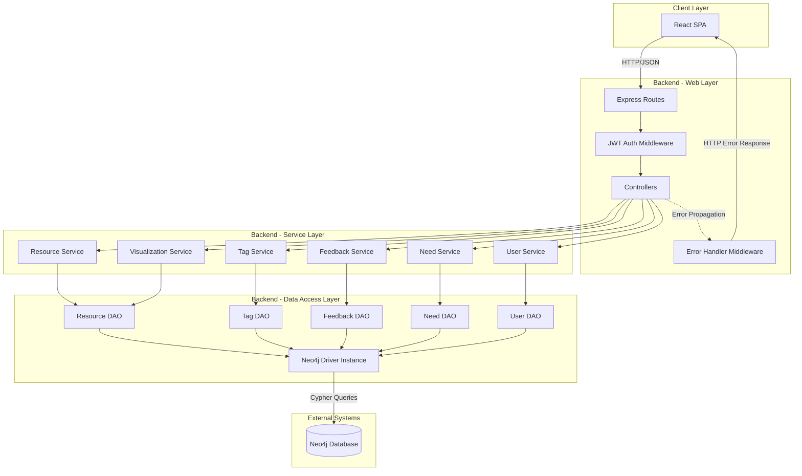
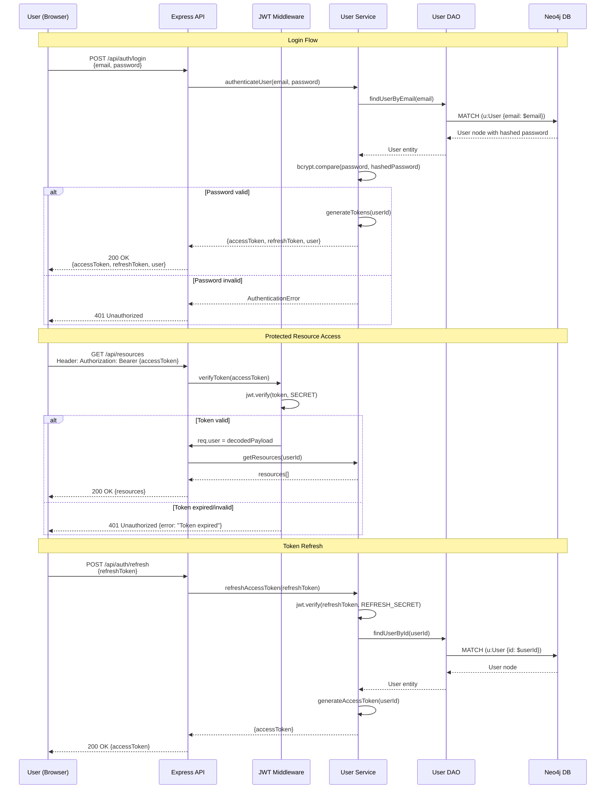
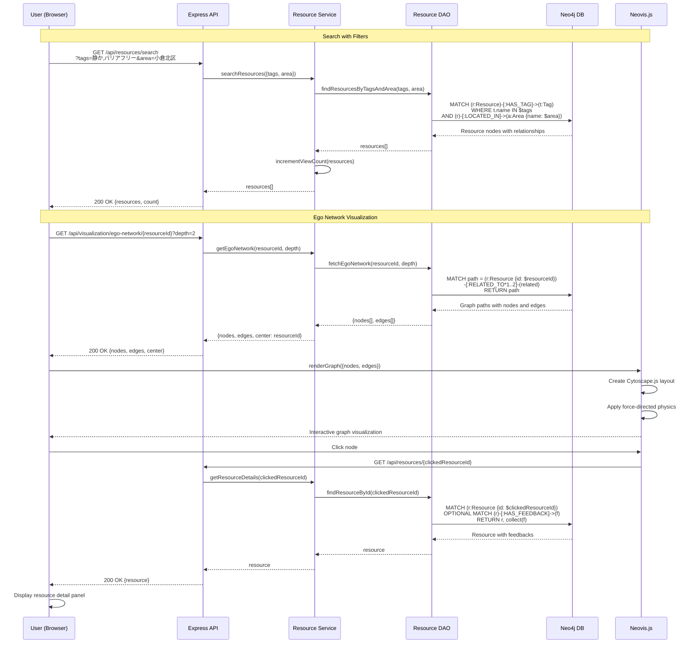
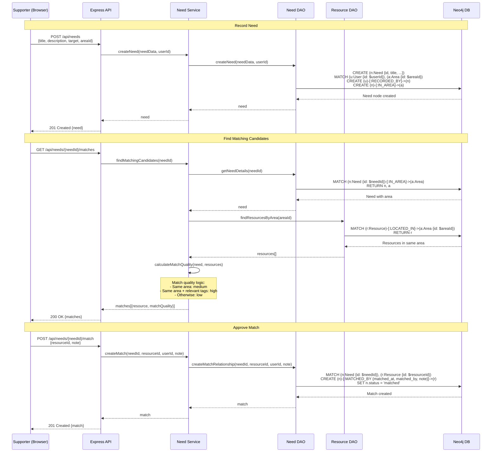
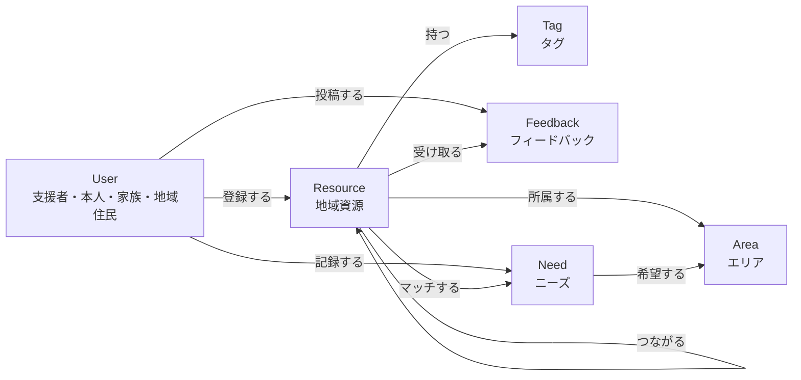

# Technical Design Document

## Feature Information
- **Feature Name**: community-resource-graph
- **Created At**: 2025-11-11T11:11:19Z
- **Design Generated At**: 2025-11-11T12:08:16Z
- **Language**: ja

---

## 1. Overview and Goals

### 1.1 Design Purpose
本設計は、障害者・精神障害者の支援ネットワークを可視化するNeo4jベースのグラフデータベースシステムの技術実装を定義します。「完璧な地図」ではなく「生きた地図」として、使いながら情報が自然に成長する「つながりの連鎖」方式を実現します。

### 1.2 Design Goals
1. **データモデルの明確化**: Neo4jのノード・リレーションシップ構造を実装可能なレベルで定義
2. **APIインターフェースの標準化**: RESTful APIの契約とエンドポイント設計
3. **セキュリティの確保**: JWT認証・認可メカニズムの実装詳細
4. **拡張性の確保**: Phase 1 (50-100件) → Phase 3 (300件) への段階的スケーリング戦略
5. **グラフ可視化の実装**: Neovis.jsを使用したエゴネットワーク可視化UI

### 1.3 Design Scope
- **含む**: データベーススキーマ、REST API設計、認証フロー、フロントエンドコンポーネント構造
- **含まない**: デプロイメント構成 (Dockerfileは作成するが本番環境構成は範囲外)、監視・ログ集約システム、CI/CDパイプライン詳細

---

## 2. Architecture Pattern & Boundary Map

### 2.1 Architecture Pattern
**選択パターン**: 3-Layer Architecture (Web Layer / Service Layer / Data Access Layer)

**選択理由**:
- Express.js REST APIの標準的パターンで保守性が高い
- レイヤー間の責務分離により、ビジネスロジックとデータアクセスを独立してテスト可能
- Neo4j Driverへの依存をData Access Layerに限定し、将来的なデータストア変更への耐性を確保

### 2.2 System Boundary Map



---

## 3. Technology Stack

| Layer | Technology | Version | Rationale |
|-------|-----------|---------|-----------|
| **Database** | Neo4j | 5.x | グラフデータベースのデファクトスタンダード、Cypher言語による強力なパターンマッチング |
| **Backend Runtime** | Node.js | 18+ LTS | Neo4j公式ドライバの完全サポート、JavaScriptエコシステムの統一 |
| **Backend Framework** | Express.js | 4.x | 軽量でミドルウェアパターンが柔軟、Neo4j統合実績豊富 |
| **Neo4j Driver** | neo4j-driver | 5.x | Neo4j公式JavaScriptドライバ、Neo4j 5.x完全対応 |
| **Authentication** | jsonwebtoken + bcryptjs | - | JWT標準実装、bcryptによる安全なパスワードハッシュ |
| **Validation** | express-validator | - | Expressミドルウェアとして統合可能、チェインバリデーション対応 |
| **Frontend Framework** | React | 18+ | コンポーネント再利用性、グラフライブラリエコシステム豊富 |
| **Graph Visualization** | Neovis.js | 2.x | Neo4j公式、React統合容易、Phase 1-2に最適 |
| **HTTP Client** | Axios | 1.x | Promiseベース、インターセプター機能でJWT自動付与 |
| **Build Tool** | Vite | 5.x | 高速なHMR、Reactとの相性良好 |
| **Package Manager** | npm | 10+ | Node.js標準、依存関係管理シンプル |

---

## 4. System Flows

### 4.1 Authentication Flow



### 4.2 Resource Search and Visualization Flow



### 4.3 Need Matching Flow



---

## 5. Requirements Traceability

### 5.1 Requirements to Components Mapping

| Requirement | Components | Interfaces | Data Models |
|------------|-----------|-----------|-------------|
| **Req 1: 資源の登録管理** | ResourceService, ResourceDAO, ResourceController | POST /api/resources, GET /api/resources/:id | Resource node (id, name, type, created_at, updated_at) |
| **Req 2: タグベース分類** | TagService, TagDAO, ResourceService | POST /api/resources/:id/tags, GET /api/tags | Tag node (name, category, usage_count), HAS_TAG relationship |
| **Req 3: エリアベース管理** | AreaService, AreaDAO, ResourceService | GET /api/areas, GET /api/areas/:id/resources | Area node (name, city, prefecture), LOCATED_IN relationship |
| **Req 4: 資源の検索・絞り込み** | ResourceService, ResourceDAO | GET /api/resources/search?tags=&area=&keyword= | Indexed Resource.name, Tag.name |
| **Req 5: フィードバック蓄積** | FeedbackService, FeedbackDAO, FeedbackController | POST /api/resources/:id/feedback, GET /api/feedbacks | Feedback node (content, visit_date, created_at), HAS_FEEDBACK relationship |
| **Req 6: 資源間のつながり管理** | ResourceService, ResourceDAO | POST /api/resources/:id/relationships, GET /api/resources/:id/connections | RELATED_TO relationship (relation_type, distance, description) |
| **Req 7: エゴネットワーク可視化** | VisualizationService, ResourceDAO, VisualizationComponent | GET /api/visualization/ego-network/:id?depth=2 | Graph structure (nodes[], edges[]) |
| **Req 8: ニーズの記録** | NeedService, NeedDAO, NeedController | POST /api/needs, GET /api/needs | Need node (title, description, target, purpose, status), IN_AREA, RECORDED_BY relationships |
| **Req 9: ニーズマッチング推薦** | NeedService, NeedDAO, ResourceDAO | GET /api/needs/:id/matches, POST /api/needs/:id/match | MATCHED_BY relationship (matched_at, matched_by, match_quality, note) |
| **Req 10: ユーザー管理・認証** | UserService, UserDAO, AuthController, JWT Middleware | POST /api/auth/register, POST /api/auth/login, GET /api/users/profile | User node (id, name, email, password_hash, role, organization) |
| **Req 11: データベースインデックス最適化** | Neo4jIndexService, Database migration scripts | N/A (DB initialization) | Indexes on Resource.name, Resource.type, Tag.name, Need.status, Area.name |
| **Req 12: 統計・分析機能** | AnalyticsService, AnalyticsDAO | GET /api/analytics/overview, GET /api/analytics/users/ranking | Aggregation queries |

### 5.2 Non-Functional Requirements Traceability

| NFR | Design Decision | Validation Method |
|-----|----------------|-------------------|
| **Performance: 検索3秒以内** | Neo4jインデックス作成、Cypherクエリ最適化 (LIMIT, WITH句) | パフォーマンステスト (JMeter/k6) |
| **Performance: エゴネットワーク5秒以内** | 深さ制限 (1..3)、ノード数上限 (100件) | 統合テスト (Jest) |
| **Scalability: 同時接続50名** | Stateless JWT認証、Neo4j接続プール | ロードテスト (k6) |
| **Scalability: 資源300件対応** | データベースインデックス、ページネーション実装 | 負荷テスト (合成データ300件) |
| **Usability: 検索結果ゼロ時の提案** | ResourceServiceに代替候補ロジック実装 | E2Eテスト (Playwright) |
| **Maintainability: Cypherクエリ集中管理** | DAOレイヤーにクエリを集約、パラメータ化 | コードレビューチェックリスト |

---

## 6. Components & Interfaces

### 6.1 Backend Components

#### 6.1.1 Web Layer

**AuthController**
```typescript
interface AuthController {
  /**
   * ユーザー登録
   * POST /api/auth/register
   */
  register(req: Request, res: Response): Promise<void>;

  /**
   * ログイン (JWT発行)
   * POST /api/auth/login
   */
  login(req: Request, res: Response): Promise<void>;

  /**
   * アクセストークン更新
   * POST /api/auth/refresh
   */
  refreshToken(req: Request, res: Response): Promise<void>;

  /**
   * ログアウト
   * POST /api/auth/logout
   */
  logout(req: Request, res: Response): Promise<void>;
}

// Request/Response DTOs
interface RegisterRequest {
  name: string;
  email: string;
  password: string;
  role: 'supporter' | 'individual' | 'family' | 'resident';
  organization?: string;
}

interface LoginRequest {
  email: string;
  password: string;
}

interface AuthResponse {
  user: {
    id: string;
    name: string;
    email: string;
    role: string;
    organization?: string;
  };
  accessToken: string;
  refreshToken: string;
}
```

**ResourceController**
```typescript
interface ResourceController {
  /**
   * 資源作成
   * POST /api/resources
   */
  createResource(req: Request, res: Response): Promise<void>;

  /**
   * 資源詳細取得
   * GET /api/resources/:id
   */
  getResourceById(req: Request, res: Response): Promise<void>;

  /**
   * 資源検索
   * GET /api/resources/search?tags=&area=&keyword=&sortBy=&page=&limit=
   */
  searchResources(req: Request, res: Response): Promise<void>;

  /**
   * 資源にタグ追加
   * POST /api/resources/:id/tags
   */
  addTags(req: Request, res: Response): Promise<void>;

  /**
   * 資源間のつながり作成
   * POST /api/resources/:id/relationships
   */
  createRelationship(req: Request, res: Response): Promise<void>;

  /**
   * つながっている資源一覧
   * GET /api/resources/:id/connections
   */
  getConnections(req: Request, res: Response): Promise<void>;
}

interface CreateResourceRequest {
  name: string;
  type: 'place' | 'person' | 'activity' | 'information';
  description?: string;
  address?: string;
  contact?: string;
  hours?: string;
  areaId: string;
  tags?: string[];
}

interface ResourceResponse {
  id: string;
  name: string;
  type: string;
  description?: string;
  address?: string;
  contact?: string;
  hours?: string;
  created_at: string;
  updated_at: string;
  view_count: number;
  feedback_count: number;
  area: {
    id: string;
    name: string;
    city: string;
    prefecture: string;
  };
  tags: Array<{
    name: string;
    category: string;
  }>;
  registered_by: {
    id: string;
    name: string;
  };
}

interface SearchResourcesQuery {
  tags?: string[];
  area?: string;
  keyword?: string;
  sortBy?: 'feedback_count' | 'created_at' | 'view_count';
  page?: number;
  limit?: number;
}

interface SearchResourcesResponse {
  resources: ResourceResponse[];
  total: number;
  page: number;
  limit: number;
  hasMore: boolean;
}
```

**FeedbackController**
```typescript
interface FeedbackController {
  /**
   * フィードバック投稿
   * POST /api/resources/:resourceId/feedback
   */
  createFeedback(req: Request, res: Response): Promise<void>;

  /**
   * 資源のフィードバック一覧
   * GET /api/resources/:resourceId/feedback
   */
  getFeedbacksByResource(req: Request, res: Response): Promise<void>;

  /**
   * フィードバックを「役立った」としてマーク
   * POST /api/feedback/:id/helpful
   */
  markHelpful(req: Request, res: Response): Promise<void>;
}

interface CreateFeedbackRequest {
  content: string;
  visit_date: string; // ISO 8601
}

interface FeedbackResponse {
  id: string;
  content: string;
  visit_date: string;
  created_at: string;
  helpful_count: number;
  author: {
    id: string;
    name: string;
    role: string;
  };
  resource: {
    id: string;
    name: string;
  };
}
```

**NeedController**
```typescript
interface NeedController {
  /**
   * ニーズ記録
   * POST /api/needs
   */
  createNeed(req: Request, res: Response): Promise<void>;

  /**
   * ニーズ一覧 (status=openを優先)
   * GET /api/needs?status=&area=&page=&limit=
   */
  getNeeds(req: Request, res: Response): Promise<void>;

  /**
   * ニーズ詳細
   * GET /api/needs/:id
   */
  getNeedById(req: Request, res: Response): Promise<void>;

  /**
   * マッチング候補取得
   * GET /api/needs/:id/matches
   */
  getMatchingCandidates(req: Request, res: Response): Promise<void>;

  /**
   * マッチング承認
   * POST /api/needs/:id/match
   */
  createMatch(req: Request, res: Response): Promise<void>;
}

interface CreateNeedRequest {
  title: string;
  description: string;
  target: string;
  purpose: string;
  areaId: string;
}

interface NeedResponse {
  id: string;
  title: string;
  description: string;
  target: string;
  purpose: string;
  status: 'open' | 'matched' | 'closed';
  view_count: number;
  created_at: string;
  area: {
    id: string;
    name: string;
  };
  recorded_by: {
    id: string;
    name: string;
    role: string;
  };
  matched_resources?: Array<{
    id: string;
    name: string;
    matched_at: string;
    note?: string;
  }>;
}

interface MatchCandidateResponse {
  resource: ResourceResponse;
  match_quality: 'high' | 'medium' | 'low';
  reason: string;
}
```

**VisualizationController**
```typescript
interface VisualizationController {
  /**
   * エゴネットワーク取得
   * GET /api/visualization/ego-network/:resourceId?depth=2
   */
  getEgoNetwork(req: Request, res: Response): Promise<void>;
}

interface EgoNetworkResponse {
  center: string; // resource ID
  depth: number;
  nodes: Array<{
    id: string;
    label: string;
    type: string;
    properties: {
      name: string;
      description?: string;
      type?: string;
    };
  }>;
  edges: Array<{
    id: string;
    source: string;
    target: string;
    relation_type: 'nearby' | 'similar' | 'sequential';
    properties: {
      distance?: string;
      description?: string;
    };
  }>;
  nodeCount: number;
  edgeCount: number;
}
```

**AnalyticsController**
```typescript
interface AnalyticsController {
  /**
   * システム統計概要
   * GET /api/analytics/overview
   */
  getOverview(req: Request, res: Response): Promise<void>;

  /**
   * エリア別資源分布
   * GET /api/analytics/distribution/area
   */
  getAreaDistribution(req: Request, res: Response): Promise<void>;

  /**
   * よく使われるタグランキング
   * GET /api/analytics/tags/popular?limit=20
   */
  getPopularTags(req: Request, res: Response): Promise<void>;

  /**
   * ユーザー貢献度ランキング
   * GET /api/analytics/users/ranking?limit=10
   */
  getUserRanking(req: Request, res: Response): Promise<void>;

  /**
   * 未マッチニーズ分析
   * GET /api/analytics/needs/unmatched
   */
  getUnmatchedNeedsAnalysis(req: Request, res: Response): Promise<void>;
}

interface AnalyticsOverviewResponse {
  total_resources: number;
  total_feedback: number;
  total_needs: number;
  open_needs: number;
  matched_needs: number;
  total_users: number;
  total_areas: number;
}
```

**Middleware Components**
```typescript
interface JWTAuthMiddleware {
  /**
   * JWT検証ミドルウェア
   * req.user にデコードされたペイロードをセット
   */
  authenticate(req: Request, res: Response, next: NextFunction): void;
}

interface ValidationMiddleware {
  /**
   * リクエストバリデーション
   * express-validator使用
   */
  validateRequest(validations: ValidationChain[]): RequestHandler[];
}

interface ErrorHandlerMiddleware {
  /**
   * グローバルエラーハンドラ
   */
  handleError(err: Error, req: Request, res: Response, next: NextFunction): void;
}
```

#### 6.1.2 Service Layer

**UserService**
```typescript
interface UserService {
  /**
   * ユーザー登録
   * パスワードハッシュ化 (bcrypt)
   */
  createUser(userData: CreateUserData): Promise<User>;

  /**
   * ログイン認証
   * パスワード検証 + JWT生成
   */
  authenticateUser(email: string, password: string): Promise<AuthResult>;

  /**
   * リフレッシュトークンからアクセストークン再生成
   */
  refreshAccessToken(refreshToken: string): Promise<string>;

  /**
   * ユーザープロフィール取得
   */
  getUserProfile(userId: string): Promise<UserProfile>;

  /**
   * ユーザーの登録資源・フィードバック数集計
   */
  getUserContributions(userId: string): Promise<UserContributions>;
}

interface CreateUserData {
  name: string;
  email: string;
  password: string;
  role: 'supporter' | 'individual' | 'family' | 'resident';
  organization?: string;
}

interface AuthResult {
  user: User;
  accessToken: string;
  refreshToken: string;
}

interface UserProfile {
  id: string;
  name: string;
  email: string;
  role: string;
  organization?: string;
  created_at: string;
  registered_resources_count: number;
  given_feedbacks_count: number;
}

interface UserContributions {
  registered_resources: ResourceResponse[];
  given_feedbacks: FeedbackResponse[];
  recorded_needs: NeedResponse[];
}
```

**ResourceService**
```typescript
interface ResourceService {
  /**
   * 資源作成
   * ID自動生成: {type}_{sequential}
   */
  createResource(resourceData: CreateResourceData, userId: string): Promise<Resource>;

  /**
   * 資源詳細取得
   * view_countインクリメント
   */
  getResourceById(resourceId: string): Promise<ResourceDetail>;

  /**
   * 資源検索
   * タグ・エリア・キーワード複合検索
   */
  searchResources(criteria: SearchCriteria): Promise<SearchResult>;

  /**
   * タグ追加/既存タグ利用
   * Tag.usage_countインクリメント
   */
  addTagsToResource(resourceId: string, tagNames: string[], categories: string[]): Promise<void>;

  /**
   * 資源間のつながり作成
   */
  createRelationship(fromId: string, toId: string, relationData: RelationData): Promise<void>;

  /**
   * つながっている資源一覧
   */
  getConnectedResources(resourceId: string): Promise<Resource[]>;

  /**
   * よく使われるタグ提案
   */
  suggestTags(limit: number): Promise<Tag[]>;
}

interface CreateResourceData {
  name: string;
  type: 'place' | 'person' | 'activity' | 'information';
  description?: string;
  address?: string;
  contact?: string;
  hours?: string;
  areaId: string;
  tags?: Array<{ name: string; category: string }>;
}

interface SearchCriteria {
  tags?: string[];
  area?: string;
  keyword?: string;
  sortBy?: 'feedback_count' | 'created_at' | 'view_count';
  page: number;
  limit: number;
}

interface SearchResult {
  resources: ResourceDetail[];
  total: number;
  page: number;
  limit: number;
  hasMore: boolean;
  suggestions?: {
    relatedTags?: string[];
    nearbyAreas?: string[];
  };
}

interface RelationData {
  relation_type: 'nearby' | 'similar' | 'sequential';
  distance?: string;
  description?: string;
}
```

**FeedbackService**
```typescript
interface FeedbackService {
  /**
   * フィードバック投稿
   * Resource.feedback_countインクリメント
   */
  createFeedback(resourceId: string, feedbackData: CreateFeedbackData, userId: string): Promise<Feedback>;

  /**
   * 資源のフィードバック一覧
   */
  getFeedbacksByResource(resourceId: string): Promise<Feedback[]>;

  /**
   * 「役立った」カウント増加
   */
  incrementHelpfulCount(feedbackId: string): Promise<void>;
}

interface CreateFeedbackData {
  content: string;
  visit_date: string;
}
```

**NeedService**
```typescript
interface NeedService {
  /**
   * ニーズ記録
   */
  createNeed(needData: CreateNeedData, userId: string): Promise<Need>;

  /**
   * ニーズ一覧取得 (status=openを優先)
   */
  getNeeds(filters: NeedFilters): Promise<Need[]>;

  /**
   * ニーズ詳細取得
   */
  getNeedById(needId: string): Promise<NeedDetail>;

  /**
   * マッチング候補資源の推薦
   * 同一エリア + タグ類似度でmatch_quality算出
   */
  findMatchingCandidates(needId: string): Promise<MatchCandidate[]>;

  /**
   * マッチング承認
   * Need.status → 'matched' に更新
   */
  createMatch(needId: string, resourceId: string, userId: string, note?: string): Promise<void>;
}

interface CreateNeedData {
  title: string;
  description: string;
  target: string;
  purpose: string;
  areaId: string;
}

interface NeedFilters {
  status?: 'open' | 'matched' | 'closed';
  area?: string;
  page: number;
  limit: number;
}

interface MatchCandidate {
  resource: ResourceDetail;
  match_quality: 'high' | 'medium' | 'low';
  reason: string;
}
```

**VisualizationService**
```typescript
interface VisualizationService {
  /**
   * エゴネットワーク取得
   * 深さ制限: 1..3
   * ノード数上限: 100件
   */
  getEgoNetwork(resourceId: string, depth: number): Promise<GraphData>;
}

interface GraphData {
  center: string;
  depth: number;
  nodes: GraphNode[];
  edges: GraphEdge[];
  nodeCount: number;
  edgeCount: number;
}

interface GraphNode {
  id: string;
  label: string;
  type: string;
  properties: Record<string, any>;
}

interface GraphEdge {
  id: string;
  source: string;
  target: string;
  relation_type: string;
  properties: Record<string, any>;
}
```

**AnalyticsService**
```typescript
interface AnalyticsService {
  /**
   * システム統計概要
   */
  getSystemOverview(): Promise<SystemOverview>;

  /**
   * エリア別資源分布
   */
  getResourceDistributionByArea(): Promise<AreaDistribution[]>;

  /**
   * よく使われるタグ (usage_count上位)
   */
  getPopularTags(limit: number): Promise<Tag[]>;

  /**
   * ユーザー貢献度ランキング
   */
  getUserRanking(limit: number): Promise<UserRanking[]>;

  /**
   * 未マッチニーズ分析
   */
  analyzeUnmatchedNeeds(): Promise<UnmatchedNeedsAnalysis>;
}

interface SystemOverview {
  total_resources: number;
  total_feedback: number;
  total_needs: number;
  open_needs: number;
  matched_needs: number;
  total_users: number;
  total_areas: number;
}

interface AreaDistribution {
  area: string;
  resource_count: number;
}

interface UserRanking {
  user_id: string;
  user_name: string;
  contribution_score: number;
  registered_resources: number;
  given_feedbacks: number;
}

interface UnmatchedNeedsAnalysis {
  unmatched_count: number;
  missing_resource_types: Array<{ type: string; count: number }>;
  affected_areas: Array<{ area: string; count: number }>;
}
```

#### 6.1.3 Data Access Layer

**Neo4jDriver Configuration**
```typescript
interface Neo4jConfig {
  uri: string;
  user: string;
  password: string;
  database?: string;
  maxConnectionPoolSize?: number;
  connectionTimeout?: number;
}

interface Neo4jDriverInstance {
  /**
   * シングルトンドライバインスタンス
   */
  getDriver(): Driver;

  /**
   * セッション取得
   */
  getSession(mode?: 'READ' | 'WRITE'): Session;

  /**
   * ドライバクローズ
   */
  close(): Promise<void>;
}
```

**ResourceDAO**
```typescript
interface ResourceDAO {
  /**
   * 資源作成
   */
  create(resource: CreateResourceData, userId: string): Promise<Resource>;

  /**
   * IDで資源取得
   */
  findById(resourceId: string): Promise<Resource | null>;

  /**
   * 検索 (タグ・エリア・キーワード)
   */
  search(criteria: SearchCriteria): Promise<Resource[]>;

  /**
   * view_countインクリメント
   */
  incrementViewCount(resourceId: string): Promise<void>;

  /**
   * feedback_countインクリメント
   */
  incrementFeedbackCount(resourceId: string): Promise<void>;

  /**
   * タグ追加/作成
   */
  addTags(resourceId: string, tags: Array<{ name: string; category: string }>): Promise<void>;

  /**
   * つながり作成
   */
  createRelationship(fromId: string, toId: string, relationData: RelationData): Promise<void>;

  /**
   * つながっている資源取得
   */
  findConnectedResources(resourceId: string): Promise<Resource[]>;

  /**
   * エゴネットワーク取得
   * Cypher: MATCH path = (r:Resource {id: $id})-[:RELATED_TO*1..$depth]-(related)
   */
  fetchEgoNetwork(resourceId: string, depth: number): Promise<GraphData>;
}
```

**UserDAO**
```typescript
interface UserDAO {
  /**
   * ユーザー作成
   */
  create(userData: CreateUserData): Promise<User>;

  /**
   * メールアドレスでユーザー検索
   */
  findByEmail(email: string): Promise<User | null>;

  /**
   * IDでユーザー検索
   */
  findById(userId: string): Promise<User | null>;

  /**
   * ユーザー貢献度集計
   */
  getUserContributions(userId: string): Promise<UserContributions>;
}
```

**FeedbackDAO**
```typescript
interface FeedbackDAO {
  /**
   * フィードバック作成
   */
  create(feedbackData: CreateFeedbackData, resourceId: string, userId: string): Promise<Feedback>;

  /**
   * 資源のフィードバック一覧
   */
  findByResourceId(resourceId: string): Promise<Feedback[]>;

  /**
   * helpful_countインクリメント
   */
  incrementHelpfulCount(feedbackId: string): Promise<void>;
}
```

**NeedDAO**
```typescript
interface NeedDAO {
  /**
   * ニーズ作成
   */
  create(needData: CreateNeedData, userId: string): Promise<Need>;

  /**
   * ニーズ一覧取得
   */
  findAll(filters: NeedFilters): Promise<Need[]>;

  /**
   * ニーズ詳細取得
   */
  findById(needId: string): Promise<Need | null>;

  /**
   * マッチング作成
   */
  createMatch(needId: string, resourceId: string, userId: string, note?: string): Promise<void>;

  /**
   * ニーズステータス更新
   */
  updateStatus(needId: string, status: 'open' | 'matched' | 'closed'): Promise<void>;
}
```

**AnalyticsDAO**
```typescript
interface AnalyticsDAO {
  /**
   * 全資源数
   */
  countAllResources(): Promise<number>;

  /**
   * 全フィードバック数
   */
  countAllFeedback(): Promise<number>;

  /**
   * 全ニーズ数
   */
  countAllNeeds(): Promise<number>;

  /**
   * ステータス別ニーズ数
   */
  countNeedsByStatus(status: 'open' | 'matched' | 'closed'): Promise<number>;

  /**
   * エリア別資源分布
   */
  getResourceDistributionByArea(): Promise<AreaDistribution[]>;

  /**
   * よく使われるタグ (usage_count降順)
   */
  getPopularTags(limit: number): Promise<Tag[]>;

  /**
   * ユーザー貢献度ランキング
   */
  getUserRanking(limit: number): Promise<UserRanking[]>;

  /**
   * 未マッチニーズ分析
   */
  analyzeUnmatchedNeeds(): Promise<UnmatchedNeedsAnalysis>;
}
```

### 6.2 Frontend Components

**App Component Structure**
```typescript
interface AppComponent {
  /**
   * ルートコンポーネント
   * React Router + Auth Context Provider
   */
  children: [
    NavbarComponent,
    RouterOutlet,
    FooterComponent
  ];
}
```

**Authentication Components**
```typescript
interface LoginComponent {
  /**
   * ログインフォーム
   * POST /api/auth/login
   */
  onSubmit(email: string, password: string): Promise<void>;
}

interface RegisterComponent {
  /**
   * ユーザー登録フォーム
   * POST /api/auth/register
   */
  onSubmit(userData: RegisterFormData): Promise<void>;
}

interface RegisterFormData {
  name: string;
  email: string;
  password: string;
  role: 'supporter' | 'individual' | 'family' | 'resident';
  organization?: string;
}
```

**Resource Components**
```typescript
interface ResourceListComponent {
  /**
   * 資源一覧・検索UI
   * GET /api/resources/search
   */
  filters: SearchFilters;
  resources: ResourceResponse[];
  onFilterChange(filters: SearchFilters): void;
  onResourceClick(resourceId: string): void;
}

interface ResourceDetailComponent {
  /**
   * 資源詳細表示
   * GET /api/resources/:id
   */
  resource: ResourceResponse;
  feedbacks: FeedbackResponse[];
  connections: ResourceResponse[];
  onAddFeedback(): void;
  onViewNetwork(): void;
}

interface ResourceFormComponent {
  /**
   * 資源登録フォーム
   * POST /api/resources
   */
  onSubmit(resourceData: CreateResourceRequest): Promise<void>;
}

interface SearchFilters {
  tags: string[];
  area: string;
  keyword: string;
  sortBy: 'feedback_count' | 'created_at';
}
```

**Feedback Components**
```typescript
interface FeedbackFormComponent {
  /**
   * フィードバック投稿フォーム
   * POST /api/resources/:id/feedback
   */
  resourceId: string;
  onSubmit(content: string, visitDate: string): Promise<void>;
}

interface FeedbackListComponent {
  /**
   * フィードバック一覧表示
   */
  feedbacks: FeedbackResponse[];
  onMarkHelpful(feedbackId: string): void;
}
```

**Need Components**
```typescript
interface NeedListComponent {
  /**
   * ニーズ一覧
   * GET /api/needs?status=open
   */
  needs: NeedResponse[];
  onNeedClick(needId: string): void;
}

interface NeedDetailComponent {
  /**
   * ニーズ詳細・マッチング候補表示
   * GET /api/needs/:id
   * GET /api/needs/:id/matches
   */
  need: NeedResponse;
  matchCandidates: MatchCandidateResponse[];
  onApproveMatch(resourceId: string, note: string): void;
}

interface NeedFormComponent {
  /**
   * ニーズ記録フォーム
   * POST /api/needs
   */
  onSubmit(needData: CreateNeedRequest): Promise<void>;
}
```

**Visualization Components**
```typescript
interface EgoNetworkComponent {
  /**
   * エゴネットワーク可視化
   * Neovis.js使用
   * GET /api/visualization/ego-network/:id?depth=2
   */
  resourceId: string;
  depth: number;
  graphData: EgoNetworkResponse;
  onNodeClick(nodeId: string): void;
  onDepthChange(depth: number): void;
}

interface NeovisConfig {
  containerId: string;
  serverUrl?: string; // Direct Neo4j connection (optional)
  dataSource: 'api' | 'direct';
  initialCypher?: string;
  labels: Record<string, NodeVisualConfig>;
  relationships: Record<string, EdgeVisualConfig>;
  layout: {
    hierarchical: boolean;
    improvedLayout: boolean;
  };
}

interface NodeVisualConfig {
  label: string;
  size: number | string;
  community: string;
  [key: string]: any;
}

interface EdgeVisualConfig {
  thickness: number | string;
  caption: boolean | string;
  [key: string]: any;
}
```

**Analytics Components**
```typescript
interface DashboardComponent {
  /**
   * 統計ダッシュボード
   * GET /api/analytics/overview
   * GET /api/analytics/distribution/area
   */
  overview: AnalyticsOverviewResponse;
  areaDistribution: AreaDistribution[];
  popularTags: Tag[];
  userRanking: UserRanking[];
}
```

**Shared Components**
```typescript
interface TagSelectorComponent {
  /**
   * タグ選択UI (サジェスト機能付き)
   * GET /api/tags/suggest
   */
  selectedTags: string[];
  onTagSelect(tag: string): void;
  onTagRemove(tag: string): void;
}

interface AreaSelectorComponent {
  /**
   * エリア選択UI
   * GET /api/areas
   */
  selectedArea: string;
  onAreaSelect(areaId: string): void;
}

interface PaginationComponent {
  /**
   * ページネーション
   */
  currentPage: number;
  totalPages: number;
  onPageChange(page: number): void;
}
```

---

## 7. Data Models

### 7.1 Domain Model (Conceptual)



### 7.2 Logical Model (Neo4j Graph Schema)

**Node Types**

```cypher
// User Node
CREATE (u:User {
  id: 'user_001',                  // ユーザーID (自動生成)
  name: '田中太郎',                 // 氏名
  email: 'tanaka@example.com',     // メールアドレス (ユニーク)
  password_hash: '$2a$10$...',     // bcryptハッシュ
  role: 'supporter',               // 役割: supporter | individual | family | resident
  organization: '相談支援事業所A',  // 所属組織 (任意)
  created_at: '2025-11-11T10:00:00Z',
  updated_at: '2025-11-11T10:00:00Z'
})

// Resource Node
CREATE (r:Resource {
  id: 'res_001',                   // 資源ID (自動生成: {type}_{sequential})
  name: '静かなカフェ',             // 資源名
  type: 'place',                   // タイプ: place | person | activity | information
  description: '感覚過敏の方も安心', // 説明 (任意)
  address: '北九州市小倉北区...', // 住所 (任意)
  contact: '093-123-4567',         // 連絡先 (任意)
  hours: '10:00-18:00',            // 営業時間 (任意)
  view_count: 0,                   // 閲覧数
  feedback_count: 0,               // フィードバック数
  created_at: '2025-11-11T10:00:00Z',
  updated_at: '2025-11-11T10:00:00Z'
})

// Tag Node
CREATE (t:Tag {
  name: '静か',                    // タグ名 (ユニーク)
  category: 'atmosphere',          // カテゴリ: atmosphere | accessibility | cost | etc.
  usage_count: 0,                  // 使用回数
  created_at: '2025-11-11T10:00:00Z'
})

// Feedback Node
CREATE (f:Feedback {
  id: 'feedback_001',              // フィードバックID (自動生成)
  content: '静かで落ち着ける...',  // 内容
  visit_date: '2025-11-05',        // 訪問日
  helpful_count: 0,                // 役立った数
  created_at: '2025-11-11T10:00:00Z'
})

// Need Node
CREATE (n:Need {
  id: 'need_001',                  // ニーズID (自動生成)
  title: '静かな作業場所を探している', // タイトル
  description: '聴覚過敏があり...',    // 説明
  target: '20代男性、発達障害',        // 対象者
  purpose: '在宅ワークの場所',         // 目的
  status: 'open',                      // ステータス: open | matched | closed
  view_count: 0,                       // 閲覧数
  created_at: '2025-11-11T10:00:00Z'
})

// Area Node
CREATE (a:Area {
  id: 'area_001',                  // エリアID (自動生成)
  name: '小倉北区',                // エリア名
  city: '北九州市',                // 市区町村
  prefecture: '福岡県',            // 都道府県
  created_at: '2025-11-11T10:00:00Z'
})
```

**Relationship Types**

```cypher
// User → Resource (登録)
CREATE (u:User {id: 'user_001'})-[:REGISTERED_BY {
  created_at: '2025-11-11T10:00:00Z'
}]->(r:Resource {id: 'res_001'})

// Resource → Tag (タグ付与)
CREATE (r:Resource {id: 'res_001'})-[:HAS_TAG {
  created_at: '2025-11-11T10:00:00Z'
}]->(t:Tag {name: '静か'})

// Resource → Area (エリア所属)
CREATE (r:Resource {id: 'res_001'})-[:LOCATED_IN {
  created_at: '2025-11-11T10:00:00Z'
}]->(a:Area {id: 'area_001'})

// Resource → Feedback (フィードバック受取)
CREATE (r:Resource {id: 'res_001'})-[:HAS_FEEDBACK {
  created_at: '2025-11-11T10:00:00Z'
}]->(f:Feedback {id: 'feedback_001'})

// User → Feedback (フィードバック投稿)
CREATE (u:User {id: 'user_001'})-[:GIVEN_BY {
  created_at: '2025-11-11T10:00:00Z'
}]->(f:Feedback {id: 'feedback_001'})

// Resource → Resource (資源間のつながり)
CREATE (r1:Resource {id: 'res_001'})-[:RELATED_TO {
  relation_type: 'nearby',         // nearby | similar | sequential
  distance: '徒歩5分',             // 距離 (任意)
  description: '公園の近くにある', // 説明 (任意)
  created_by: 'user_001',          // 作成者
  created_at: '2025-11-11T10:00:00Z'
}]->(r2:Resource {id: 'res_002'})

// User → Need (ニーズ記録)
CREATE (u:User {id: 'user_001'})-[:RECORDED_BY {
  created_at: '2025-11-11T10:00:00Z'
}]->(n:Need {id: 'need_001'})

// Need → Area (希望エリア)
CREATE (n:Need {id: 'need_001'})-[:IN_AREA {
  created_at: '2025-11-11T10:00:00Z'
}]->(a:Area {id: 'area_001'})

// Need → Resource (マッチング)
CREATE (n:Need {id: 'need_001'})-[:MATCHED_BY {
  matched_at: '2025-11-11T12:00:00Z',
  matched_by: 'user_002',          // マッチング承認者
  match_quality: 'high',           // high | medium | low
  note: 'タグが完全一致'           // 備考 (任意)
}]->(r:Resource {id: 'res_001'})
```

### 7.3 Physical Model (Database Constraints & Indexes)

**Indexes**
```cypher
// Resource indexes
CREATE INDEX resource_name_index FOR (r:Resource) ON (r.name);
CREATE INDEX resource_type_index FOR (r:Resource) ON (r.type);

// Tag indexes
CREATE INDEX tag_name_index FOR (t:Tag) ON (t.name);

// User indexes
CREATE CONSTRAINT user_email_unique FOR (u:User) REQUIRE u.email IS UNIQUE;

// Need indexes
CREATE INDEX need_status_index FOR (n:Need) ON (n.status);

// Area indexes
CREATE INDEX area_name_index FOR (a:Area) ON (a.name);
```

**Constraints**
```cypher
// User email uniqueness
CREATE CONSTRAINT user_email_unique FOR (u:User) REQUIRE u.email IS UNIQUE;

// Node ID uniqueness
CREATE CONSTRAINT resource_id_unique FOR (r:Resource) REQUIRE r.id IS UNIQUE;
CREATE CONSTRAINT user_id_unique FOR (u:User) REQUIRE u.id IS UNIQUE;
CREATE CONSTRAINT feedback_id_unique FOR (f:Feedback) REQUIRE f.id IS UNIQUE;
CREATE CONSTRAINT need_id_unique FOR (n:Need) REQUIRE n.id IS UNIQUE;
CREATE CONSTRAINT area_id_unique FOR (a:Area) REQUIRE a.id IS UNIQUE;
```

---

## 8. Error Handling

### 8.1 Error Classification

| Error Type | HTTP Status | Description | Example |
|-----------|-------------|-------------|---------|
| **ValidationError** | 400 | リクエストパラメータのバリデーションエラー | 必須フィールド欠落、フォーマット不正 |
| **AuthenticationError** | 401 | 認証失敗 (JWT無効/期限切れ) | トークン期限切れ、パスワード不一致 |
| **AuthorizationError** | 403 | 認可失敗 (権限不足) | 他人の資源を編集しようとした |
| **NotFoundError** | 404 | リソースが存在しない | 存在しない資源ID |
| **ConflictError** | 409 | リソース競合 | メールアドレス重複 |
| **DatabaseError** | 500 | データベース接続/クエリエラー | Neo4j接続失敗 |
| **InternalServerError** | 500 | その他の予期しないエラー | 未処理例外 |

### 8.2 Error Response Format

```typescript
interface ErrorResponse {
  error: {
    type: string;          // エラータイプ
    message: string;       // ユーザー向けメッセージ (日本語)
    details?: any;         // 詳細情報 (開発環境のみ)
    code?: string;         // エラーコード (例: ERR_TOKEN_EXPIRED)
    timestamp: string;     // ISO 8601
    path: string;          // リクエストパス
  };
}

// Example
{
  "error": {
    "type": "ValidationError",
    "message": "資源名は必須です",
    "details": {
      "field": "name",
      "constraint": "required"
    },
    "code": "ERR_VALIDATION_FAILED",
    "timestamp": "2025-11-11T10:00:00Z",
    "path": "/api/resources"
  }
}
```

### 8.3 Error Handling Strategy

**Controller層**
- try-catchでService層の例外をキャッチ
- エラータイプに応じた適切なHTTPステータスコードを返却
- ErrorHandlerMiddlewareに伝播

**Service層**
- ビジネスロジックエラーをカスタム例外でスロー
- `throw new ValidationError("資源名は必須です")`

**DAO層**
- Neo4jドライバのエラーをラップしてスロー
- 接続エラー、クエリエラーをDatabaseErrorに変換

**Global Error Handler**
```typescript
function errorHandler(err: Error, req: Request, res: Response, next: NextFunction) {
  const errorResponse: ErrorResponse = {
    error: {
      type: err.constructor.name,
      message: err.message,
      details: process.env.NODE_ENV === 'development' ? err.stack : undefined,
      timestamp: new Date().toISOString(),
      path: req.path
    }
  };

  const statusCode = getStatusCode(err);
  res.status(statusCode).json(errorResponse);
}

function getStatusCode(err: Error): number {
  if (err instanceof ValidationError) return 400;
  if (err instanceof AuthenticationError) return 401;
  if (err instanceof AuthorizationError) return 403;
  if (err instanceof NotFoundError) return 404;
  if (err instanceof ConflictError) return 409;
  return 500;
}
```

---

## 9. Testing Strategy

### 9.1 Testing Pyramid

```
       /\
      /  \
     / E2E \          E2Eテスト (5%)
    /______\          - Playwright使用
   /        \         - 主要ユーザーフロー
  / Integration\      統合テスト (25%)
 /__________\        - Service + DAO + Neo4j
/            \       ユニットテスト (70%)
/   Unit Tests \     - 個別関数・メソッド
/________________\   - Jestでモック使用
```

### 9.2 Unit Tests (Jest)

**対象**: Service層、DAO層の個別メソッド
**ツール**: Jest + ts-jest
**カバレッジ目標**: 80%以上

**例**:
```typescript
describe('ResourceService', () => {
  let resourceService: ResourceService;
  let mockResourceDAO: jest.Mocked<ResourceDAO>;

  beforeEach(() => {
    mockResourceDAO = {
      create: jest.fn(),
      findById: jest.fn(),
      // ...
    } as any;
    resourceService = new ResourceService(mockResourceDAO);
  });

  it('should create resource with auto-generated ID', async () => {
    const resourceData = { name: 'テスト資源', type: 'place', areaId: 'area_001' };
    const userId = 'user_001';

    mockResourceDAO.create.mockResolvedValue({
      id: 'res_001',
      ...resourceData,
      view_count: 0,
      feedback_count: 0,
      created_at: '2025-11-11T10:00:00Z'
    });

    const result = await resourceService.createResource(resourceData, userId);

    expect(result.id).toMatch(/^res_\d+$/);
    expect(mockResourceDAO.create).toHaveBeenCalledWith(resourceData, userId);
  });
});
```

### 9.3 Integration Tests (Jest + Test Containers)

**対象**: Service + DAO + 実際のNeo4jデータベース
**ツール**: Jest + Testcontainers (Neo4jコンテナ)
**カバレッジ目標**: 主要APIエンドポイント全て

**例**:
```typescript
describe('ResourceService Integration', () => {
  let neo4jContainer: StartedTestContainer;
  let driver: Driver;
  let resourceService: ResourceService;

  beforeAll(async () => {
    neo4jContainer = await new GenericContainer('neo4j:5-community')
      .withEnvironment({ NEO4J_AUTH: 'neo4j/testpassword' })
      .withExposedPorts(7687)
      .start();

    const uri = `bolt://localhost:${neo4jContainer.getMappedPort(7687)}`;
    driver = neo4j.driver(uri, neo4j.auth.basic('neo4j', 'testpassword'));

    const resourceDAO = new ResourceDAO(driver);
    resourceService = new ResourceService(resourceDAO);
  });

  afterAll(async () => {
    await driver.close();
    await neo4jContainer.stop();
  });

  it('should persist and retrieve resource from Neo4j', async () => {
    const resourceData = { name: '統合テスト資源', type: 'place', areaId: 'area_test' };
    const userId = 'user_test';

    const created = await resourceService.createResource(resourceData, userId);
    const retrieved = await resourceService.getResourceById(created.id);

    expect(retrieved).toBeDefined();
    expect(retrieved.name).toBe(resourceData.name);
  });
});
```

### 9.4 E2E Tests (Playwright)

**対象**: フロントエンドからバックエンドまでの完全なユーザーフロー
**ツール**: Playwright
**カバレッジ目標**: 主要ユースケース 5シナリオ

**テストシナリオ**:
1. **ユーザー登録→ログイン→資源登録→検索→詳細閲覧**
2. **フィードバック投稿→「役立った」マーク**
3. **ニーズ記録→マッチング候補確認→マッチング承認**
4. **エゴネットワーク可視化→ノードクリック→詳細パネル表示**
5. **統計ダッシュボード閲覧**

**例**:
```typescript
test('User can register, login, create resource, and search', async ({ page }) => {
  // 登録
  await page.goto('http://localhost:3000/register');
  await page.fill('[name="name"]', 'テストユーザー');
  await page.fill('[name="email"]', 'test@example.com');
  await page.fill('[name="password"]', 'password123');
  await page.selectOption('[name="role"]', 'supporter');
  await page.click('button[type="submit"]');

  // ログイン
  await page.waitForURL('http://localhost:3000/login');
  await page.fill('[name="email"]', 'test@example.com');
  await page.fill('[name="password"]', 'password123');
  await page.click('button[type="submit"]');

  // 資源登録
  await page.waitForURL('http://localhost:3000/resources');
  await page.click('text=資源を登録');
  await page.fill('[name="name"]', 'E2Eテスト資源');
  await page.selectOption('[name="type"]', 'place');
  await page.fill('[name="description"]', 'テスト説明');
  await page.click('button[type="submit"]');

  // 検索
  await page.waitForURL('http://localhost:3000/resources');
  await page.fill('[name="keyword"]', 'E2Eテスト');
  await page.click('button[type="submit"]');

  // 結果確認
  await expect(page.locator('text=E2Eテスト資源')).toBeVisible();
});
```

### 9.5 Performance Tests

**対象**: 検索クエリ、エゴネットワーク取得
**ツール**: k6 (load testing)
**目標**:
- 検索レスポンス: 3秒以内 (資源数1000件以下)
- エゴネットワーク: 5秒以内 (深さ3、100ノード以下)
- 同時接続: 50ユーザー

**例 (k6)**:
```javascript
import http from 'k6/http';
import { check, sleep } from 'k6';

export let options = {
  stages: [
    { duration: '1m', target: 50 },  // 50ユーザーまでランプアップ
    { duration: '3m', target: 50 },  // 50ユーザーで3分維持
    { duration: '1m', target: 0 },   // ランプダウン
  ],
  thresholds: {
    http_req_duration: ['p(95)<3000'], // 95%のリクエストが3秒以内
  },
};

export default function () {
  const res = http.get('http://localhost:4000/api/resources/search?tags=静か&area=小倉北区');
  check(res, {
    'status is 200': (r) => r.status === 200,
    'response time < 3s': (r) => r.timings.duration < 3000,
  });
  sleep(1);
}
```

---

## 10. Security Considerations

### 10.1 Authentication & Authorization

**JWT Token Strategy**
- **Access Token**: 有効期限15分、ペイロードにuser ID、role含む
- **Refresh Token**: 有効期限7日、httpOnlyクッキーで保存
- **Token Storage**: LocalStorage (Access Token)、httpOnly Cookie (Refresh Token)

**Password Security**
- bcryptでハッシュ化 (ソルトラウンド: 10)
- パスワード要件: 最低8文字、英数字混在

**Authorization Logic**
```typescript
// Middleware example
function requireRole(allowedRoles: string[]) {
  return (req: Request, res: Response, next: NextFunction) => {
    const user = req.user; // JWT middleware でセット済み
    if (!user || !allowedRoles.includes(user.role)) {
      return res.status(403).json({ error: 'Forbidden' });
    }
    next();
  };
}

// Usage in routes
router.post('/api/resources', authenticate, requireRole(['supporter', 'resident']), createResource);
```

### 10.2 Input Validation

**バリデーション戦略**
- express-validatorでリクエストパラメータ検証
- XSS対策: HTML入力のサニタイズ
- SQLインジェクション対策: Cypherクエリのパラメータ化

**例**:
```typescript
import { body, validationResult } from 'express-validator';

const createResourceValidation = [
  body('name').notEmpty().withMessage('資源名は必須です').trim().escape(),
  body('type').isIn(['place', 'person', 'activity', 'information']).withMessage('不正なタイプです'),
  body('email').optional().isEmail().withMessage('メールアドレスの形式が不正です'),
];

router.post('/api/resources', createResourceValidation, (req, res) => {
  const errors = validationResult(req);
  if (!errors.isEmpty()) {
    return res.status(400).json({ errors: errors.array() });
  }
  // 処理続行
});
```

### 10.3 CORS Configuration

```typescript
import cors from 'cors';

const corsOptions = {
  origin: process.env.FRONTEND_URL || 'http://localhost:3000',
  credentials: true, // httpOnlyクッキー送信許可
  optionsSuccessStatus: 200
};

app.use(cors(corsOptions));
```

### 10.4 Rate Limiting

```typescript
import rateLimit from 'express-rate-limit';

const limiter = rateLimit({
  windowMs: 15 * 60 * 1000, // 15分
  max: 100, // 100リクエスト/15分
  message: 'リクエスト回数が上限を超えました。しばらく待ってから再試行してください。'
});

app.use('/api/', limiter);
```

### 10.5 Secrets Management

- 環境変数で管理: `.env`ファイル (gitignore必須)
- 本番環境: AWS Secrets Manager / HashiCorp Vault推奨

```bash
# .env example
NEO4J_URI=bolt://localhost:7687
NEO4J_USER=neo4j
NEO4J_PASSWORD=your_password
JWT_SECRET=your_jwt_secret_key
JWT_REFRESH_SECRET=your_refresh_secret_key
```

---

## 11. Performance & Scalability

### 11.1 Database Performance

**インデックス戦略**
- Resource.name, Resource.type, Tag.name, Need.status, Area.nameにインデックス作成
- 複合インデックス不要 (現状のクエリパターンでは単一カラムで十分)

**クエリ最適化**
- LIMIT句で結果数制限 (デフォルト20件、最大100件)
- WITH句でパイプライン最適化
- EXPLAIN / PROFILEでクエリプラン確認

**例**:
```cypher
// 最適化前: 全資源取得後フィルタ
MATCH (r:Resource)
WHERE r.type = 'place'
RETURN r
LIMIT 20

// 最適化後: インデックス使用 + 早期LIMIT
MATCH (r:Resource)
WHERE r.type = 'place'
WITH r LIMIT 20
RETURN r
```

**接続プール設定**
```typescript
const driver = neo4j.driver(
  process.env.NEO4J_URI,
  neo4j.auth.basic(process.env.NEO4J_USER, process.env.NEO4J_PASSWORD),
  {
    maxConnectionPoolSize: 50,
    connectionAcquisitionTimeout: 60000, // 60秒
  }
);
```

### 11.2 API Performance

**ページネーション実装**
```typescript
interface PaginationParams {
  page: number;
  limit: number;
}

function paginate(params: PaginationParams) {
  const skip = (params.page - 1) * params.limit;
  return { skip, limit: params.limit };
}

// Cypher with pagination
const { skip, limit } = paginate({ page: 2, limit: 20 });
const query = `
  MATCH (r:Resource)
  RETURN r
  SKIP $skip
  LIMIT $limit
`;
```

**キャッシング戦略** (Phase 2以降で検討)
- Redis導入でよく検索されるタグ・エリアをキャッシュ
- GraphData (エゴネットワーク) の短期キャッシュ (TTL: 5分)

### 11.3 Frontend Performance

**コード分割**
- React.lazy + Suspenseで非同期コンポーネント読み込み
- ルートベース分割 (各ページを個別バンドル)

**例**:
```typescript
const ResourceList = React.lazy(() => import('./components/ResourceList'));
const EgoNetwork = React.lazy(() => import('./components/EgoNetwork'));

function App() {
  return (
    <Suspense fallback={<div>Loading...</div>}>
      <Routes>
        <Route path="/resources" element={<ResourceList />} />
        <Route path="/visualization" element={<EgoNetwork />} />
      </Routes>
    </Suspense>
  );
}
```

**画像最適化**
- 画像圧縮 (WebP形式)
- Lazy loading (Intersection Observer)

**Neovis.js最適化**
- ノード数上限100件で描画負荷軽減
- force-directed layoutの反復回数制限

### 11.4 Scalability Considerations

**Phase 1-2 (50-200資源)**
- 単一Neo4jインスタンス
- Expressサーバー1台
- 水平スケーリング不要

**Phase 3以降 (300+資源)**
- Neo4j Causal Cluster (読み取りレプリカ)
- Expressサーバーの水平スケーリング (ロードバランサー追加)
- Redis導入でセッション管理・キャッシング

---

## 12. Deployment & Operations (概要)

### 12.1 Containerization

**Dockerfile (Backend)**
```dockerfile
FROM node:18-alpine
WORKDIR /app
COPY package*.json ./
RUN npm ci --only=production
COPY . .
RUN npm run build
EXPOSE 4000
CMD ["node", "dist/index.js"]
```

**Dockerfile (Frontend)**
```dockerfile
FROM node:18-alpine AS builder
WORKDIR /app
COPY package*.json ./
RUN npm ci
COPY . .
RUN npm run build

FROM nginx:alpine
COPY --from=builder /app/dist /usr/share/nginx/html
EXPOSE 80
CMD ["nginx", "-g", "daemon off;"]
```

**docker-compose.yml**
```yaml
version: '3.8'
services:
  neo4j:
    image: neo4j:5-community
    ports:
      - "7474:7474"
      - "7687:7687"
    environment:
      NEO4J_AUTH: neo4j/password
    volumes:
      - neo4j_data:/data

  backend:
    build: ./backend
    ports:
      - "4000:4000"
    environment:
      NEO4J_URI: bolt://neo4j:7687
      NEO4J_USER: neo4j
      NEO4J_PASSWORD: password
    depends_on:
      - neo4j

  frontend:
    build: ./frontend
    ports:
      - "3000:80"
    depends_on:
      - backend

volumes:
  neo4j_data:
```

### 12.2 Environment Configuration

**開発環境**
- ローカルNeo4jインスタンス (Docker)
- npm run dev (hot reload)

**本番環境** (Phase 2以降で検討)
- Neo4j Aura (マネージドサービス)
- Heroku / AWS ECS / GCP Cloud Run
- 環境変数: Secrets Manager使用

### 12.3 Monitoring & Logging (範囲外、参考情報)

**ログ戦略**
- Winston/Pino使用
- JSON形式でログ出力
- ログレベル: ERROR, WARN, INFO, DEBUG

**メトリクス** (Phase 2以降)
- Prometheus + Grafana
- Neo4jメトリクス: クエリ実行時間、接続プール使用率
- APIメトリクス: レスポンスタイム、エラー率

---

## 13. Risks and Mitigations

| Risk | Impact | Probability | Mitigation |
|------|--------|-------------|------------|
| **Neovis.js性能限界 (200+ノード)** | 高 | 中 | Phase 3でCytoscape.jsへの移行パス設計、ノード数上限100件設定 |
| **Neo4j接続プール枯渇** | 高 | 低 | 接続プール設定最適化 (maxConnectionPoolSize: 50)、タイムアウト設定 |
| **JWT Secret漏洩** | 高 | 低 | 環境変数管理、定期的なSecret更新、本番環境でSecrets Manager使用 |
| **エゴネットワーククエリのパフォーマンス低下** | 中 | 中 | 深さ制限 (1..3)、ノード数上限、インデックス活用 |
| **フロントエンドバンドルサイズ肥大化** | 中 | 中 | コード分割、Tree shaking、Neovis.jsの遅延読み込み |
| **初期データ不足 (Phase 1)** | 中 | 高 | デモデータ作成スクリプト、ユーザーオンボーディング支援機能 |
| **ユーザー権限管理の複雑化** | 低 | 低 | 初期は4ロールのみ、Phase 2以降で詳細権限管理検討 |

---

## 14. Future Enhancements (Phase 3以降)

### 14.1 Advanced Graph Visualization
- Cytoscape.jsへの完全移行 (300+ノード対応)
- Community Detection アルゴリズム適用
- 時系列変化アニメーション

### 14.2 Machine Learning Integration
- 資源推薦エンジン (協調フィルタリング)
- ニーズマッチングの精度向上 (NLP使用)
- 異常検知 (不正フィードバック検出)

### 14.3 Real-time Features
- WebSocket使用でリアルタイム通知
- 同時編集機能 (Collaborative Editing)

### 14.4 Mobile Application
- React Native使用
- オフライン対応

### 14.5 API Versioning & GraphQL
- REST API v2設計
- GraphQLエンドポイント追加 (柔軟なデータ取得)

---

## 15. Glossary

| 用語 | 説明 |
|-----|------|
| **つながりの連鎖** | 「知っている人が知っている人につながる」方式で情報が自然に成長する仕組み |
| **エゴネットワーク** | 特定のノード (資源) を中心とした1〜3段階のつながりネットワーク |
| **Phase 1** | Week 1-4: 初期データ50-100件、基本CRUD機能実装 |
| **Phase 2** | Week 5-8: フィードバック蓄積、つながり情報形成 |
| **Phase 3** | Week 9-12: 高度な可視化、統計分析、300件規模対応 |
| **JWT** | JSON Web Token: ステートレス認証方式 |
| **Cypher** | Neo4jのグラフクエリ言語 |
| **Neovis.js** | Neo4j公式グラフ可視化ライブラリ |
| **DAO** | Data Access Object: データアクセスを抽象化するパターン |
| **EARS** | Easy Approach to Requirements Syntax: 要件記述標準フォーマット |

---

_Design Document Version: 1.0_
_Last Updated: 2025-11-11T12:08:16Z_
_Author: AI-DLC Spec-Driven Development Process_
