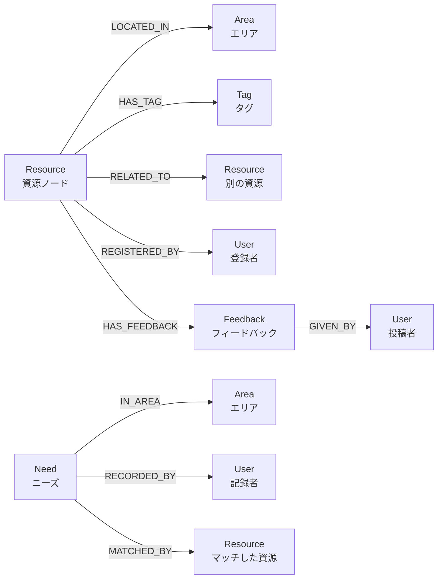

# Neo4jデータモデル設計

## ノードとリレーションシップ



## ノード詳細設計

### 1. Resource（資源）ノード
```cypher
(:Resource {
  id: "res_001",
  name: "カフェ「月のしずく」",
  type: "place",  // place, person, activity, information
  description: "静かで落ち着いた雰囲気のカフェ...",
  address: "小倉北区堺町1-2-3",
  contact: "093-XXX-XXXX",
  hours: "9:00-18:00（月曜定休）",
  created_at: "2024-10-15T10:00:00",
  updated_at: "2024-11-01T15:30:00",
  view_count: 45,
  feedback_count: 3
})
```

### 2. Tag（タグ）ノード
```cypher
(:Tag {
  id: "tag_001",
  name: "静か",
  category: "atmosphere",  // atmosphere, accessibility, cost, etc.
  usage_count: 12
})
```

### 3. User（ユーザー）ノード
```cypher
(:User {
  id: "user_001",
  name: "田中支援員",
  organization: "〇〇相談支援事業所",
  registered_resources: 5,
  given_feedbacks: 12,
  created_at: "2024-09-01T09:00:00"
})
```

### 4. Feedback（フィードバック）ノード
```cypher
(:Feedback {
  id: "fb_001",
  content: "Bさんとの面談で利用。マスターが気を遣ってくれて...",
  visit_date: "2024-11-01",
  created_at: "2024-11-01T18:00:00",
  helpful_count: 3
})
```

### 5. Need（ニーズ）ノード
```cypher
(:Need {
  id: "need_001",
  title: "手話対応できる医療機関（耳鼻科・内科）",
  description: "聴覚障害のある方が安心して受診できる...",
  area: "八幡東区",
  target: "聴覚障害のある成人",
  purpose: "定期的な健康管理",
  status: "open",  // open, matched, closed
  created_at: "2024-11-05T14:00:00",
  view_count: 8
})
```

### 6. Area（エリア）ノード
```cypher
(:Area {
  id: "area_001",
  name: "小倉北区",
  city: "北九州市",
  prefecture: "福岡県"
})
```

## リレーションシップ詳細

### RELATED_TO（資源間の関係）
```cypher
(r1:Resource)-[:RELATED_TO {
  relation_type: "nearby",  // nearby, similar, sequential
  distance: "徒歩5分",
  description: "作業実習後に立ち寄れる",
  created_by: "user_001",
  created_at: "2024-10-20T12:00:00"
}]->(r2:Resource)
```

### HAS_FEEDBACK
```cypher
(r:Resource)-[:HAS_FEEDBACK {
  created_at: "2024-11-01T18:00:00"
}]->(f:Feedback)
```

### MATCHED_BY（ニーズと資源のマッチング）
```cypher
(n:Need)-[:MATCHED_BY {
  matched_at: "2024-11-06T10:00:00",
  matched_by: "user_002",
  match_quality: "high",  // high, medium, low
  note: "完全にニーズに合致"
}]->(r:Resource)
```

## クエリ例

### 1. 特定エリアの「静かな」場所を検索
```cypher
MATCH (r:Resource)-[:LOCATED_IN]->(a:Area {name: "小倉北区"})
MATCH (r)-[:HAS_TAG]->(t:Tag {name: "静か"})
RETURN r, a, t
ORDER BY r.feedback_count DESC
LIMIT 10
```

### 2. 資源とその関連資源を取得
```cypher
MATCH (r:Resource {id: "res_001"})-[:RELATED_TO*1..2]-(related:Resource)
RETURN r, related
```

### 3. 未マッチのニーズと候補資源を推薦
```cypher
MATCH (n:Need {status: "open"})
MATCH (n)-[:IN_AREA]->(a:Area)
MATCH (r:Resource)-[:LOCATED_IN]->(a)
WHERE NOT (n)-[:MATCHED_BY]->(r)
RETURN n, r, a
```

### 4. ユーザーの貢献度を集計
```cypher
MATCH (u:User)
OPTIONAL MATCH (u)-[:REGISTERED_BY]-(r:Resource)
OPTIONAL MATCH (u)-[:GIVEN_BY]-(f:Feedback)
RETURN u.name, 
       count(DISTINCT r) as resources_registered,
       count(DISTINCT f) as feedbacks_given
ORDER BY resources_registered + feedbacks_given DESC
```

### 5. つながりの可視化（エゴネットワーク）
```cypher
MATCH path = (r:Resource {id: "res_001"})-[:RELATED_TO*1..3]-(connected)
RETURN path
```

## データ成長戦略

### Phase 1: 初期データ（Week 1-4）
- 50-100個の資源ノード
- 5-10人のユーザーノード
- 基本的なタグ（20-30個）
- 少数のつながり（10-20個）

### Phase 2: フィードバック蓄積（Week 4-12）
- フィードバックノード: 50-100個
- つながりの増加: 50-100個
- ニーズノード: 10-20個

### Phase 3: ネットワーク形成（Week 12-24）
- 資源ノード: 200-300個
- 複雑なつながりネットワーク
- ニーズマッチング機能の活用
- コミュニティ形成の可視化

## インデックス設定
```cypher
CREATE INDEX resource_name FOR (r:Resource) ON (r.name);
CREATE INDEX resource_type FOR (r:Resource) ON (r.type);
CREATE INDEX tag_name FOR (t:Tag) ON (t.name);
CREATE INDEX need_status FOR (n:Need) ON (n.status);
CREATE INDEX area_name FOR (a:Area) ON (a.name);
```
