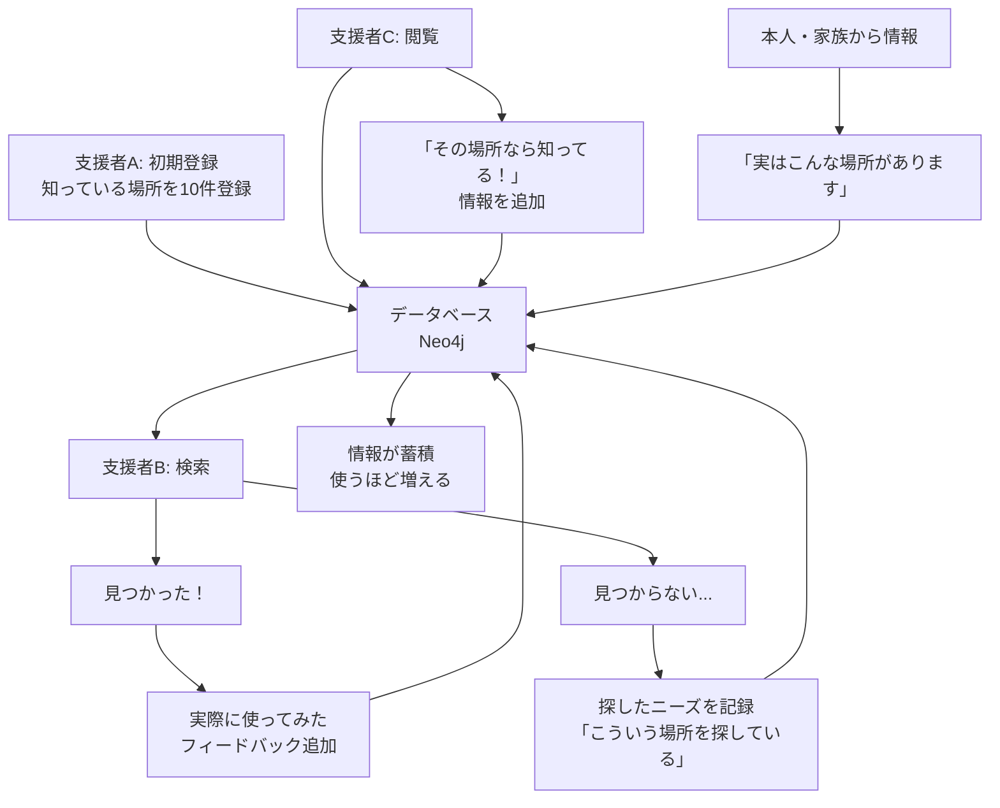

# コミュニティ・リソース・グラフ - システム概要

## 情報の流れ（つながりの連鎖）



## ユーザーの役割

1. **情報提供者（支援者・地域住民）**
   - 知っている資源を登録
   - 使った場所のフィードバック
   - 不足している情報の補完

2. **情報探索者（支援者）**
   - ニーズに合った資源を検索
   - 見つからない場合は「探しているもの」を記録

3. **情報育成者（全員）**
   - 使いながら情報を更新
   - つながりを追加
   - 評価・コメント

## データの成長イメージ

```
Week 1: 支援者5人 × 10件 = 50件の資源
Week 4: フィードバック30件、新規追加20件 = 100件
Week 12: つながり情報200件、コメント150件
Week 24: 地域の「生きた資源マップ」完成
```
